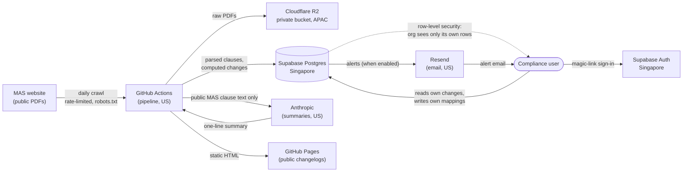

# Clausewatch — Vendor Security & Data Handling Pack

**DRAFT — factual technical description, not reviewed by a lawyer.** Fill every
`[PLACEHOLDER]` before sending. Keep it in sync with the code: this document makes
claims that a financial institution's security reviewer can and will test.

**Entity:** [LEGAL ENTITY NAME] (UEN [UEN])
**Product:** Clausewatch — Singapore regulatory change detection
**Security contact / DPO:** [DPO NAME], [DPO EMAIL]
**Last updated:** [DATE] · **Version:** 1.0

---

## 0. The one-paragraph answer

Clausewatch monitors public MAS regulatory instruments and tells a compliance team,
clause by clause, what changed and which of *their own* internal controls reference the
changed clause. **The data we hold about you is an account (work email, organisation
name) and the labels of your internal controls (e.g. "AML-POL-4.2"). We do not hold your
policies, your clients' data, transaction data, financial data, or any regulated data.**
There is no such data in the system to lose. The regulatory corpus we process is public
data published by MAS.

If your questionnaire has a single "what client data does this vendor hold?" field, the
answer is: **none of your clients' data; only your users' email addresses and your own
control-reference labels.**

---

## 1. What we hold, precisely

Being exact here is the point — a vague "we hold no data" claim fails the first probe.

**We hold:**

| Data | Example | Why |
|---|---|---|
| User email address | `mlro@yourfirm.com.sg` | Sign-in (magic link) and alert delivery |
| Organisation name | "Your Firm Pte Ltd" | Grouping users, labelling alerts |
| Internal control reference labels | `AML-POL-4.2`, `SOP-Onboarding-11` | The moat feature: mapping your controls to clauses |
| Optional notes / owner email on a mapping | "Owner: Jane; review quarterly" | Your convenience, entered by you |
| Watchlist selections | "following Notice 626, PSN01" | Which instruments to alert you about |
| Usage events | login, alert viewed, mapping created (with timestamps) | Product analytics and your own audit trail |

**We do not hold, request, or want:**

- Your internal policies, procedures, or control *documents* — only the reference label
- Your clients' or customers' personal data
- Transaction data, portfolio data, account balances, or any financial data
- NRIC / passport / government identifiers
- Payment card details (a future payment processor collects those directly; they never
  reach us)
- Any data subject to MAS-regulated activity

A control reference like `AML-POL-4.2` is an organisational identifier. It reveals that
you have a control by that name mapped to a clause; it does not contain the control's
contents. If you enter a person's name or email as a control owner, that is personal
data you have chosen to provide, and you should have a basis to do so.

---

## 2. Data-flow diagram

**In words:** the pipeline runs on a schedule, pulls public MAS PDFs, stores the raw
files privately in R2, parses them into clauses in the Singapore database, computes what
changed, and asks Anthropic for a one-line *descriptive* summary — sending only the
public MAS text, never any customer data. A compliance user signs in with a magic link,
reads the changes relevant to their org, and writes their own control mappings. Every
tenant read and write is scoped by database row-level security. When email is enabled,
alerts go out through Resend.

**There is no application server.** The browser talks to Supabase directly, and every
access is constrained by row-level security policies and capped read-only database
functions — described in §4.

---

## 3. Subprocessors

| Provider | Purpose | Customer personal data processed | Location |
|---|---|---|---|
| **Supabase** | Primary database and authentication | Account, configuration, usage data | **Singapore** |
| **Cloudflare** | Object storage (raw MAS PDFs), network security | None (public MAS documents only) | Asia-Pacific / global edge |
| **GitHub** | Static site hosting; scheduled pipeline | None | United States |
| **Anthropic** | Descriptive summaries of regulatory changes | **None — public MAS text only** | United States |
| **Resend** | Alert and service email *(not yet active)* | Name, email address, message content | United States |

We keep this list current and will notify material changes. The primary datastore for
your account and configuration data is in **Singapore**. Where a subprocessor is outside
Singapore, transfers are handled under PDPA s.26 through the provider's data processing
terms.

---

## 4. Tenant isolation — the control an FI cares about most

Multiple client organisations share one database. One org must never read or write
another's data. This is enforced in the **database**, not in application code that a
bug could bypass:

- **Row-level security (RLS)** is enabled on every tenant table (`organisations`,
  `memberships`, `watchlists`, `control_mappings`, `alerts`, `usage_events`). Each policy
  restricts rows to the caller's organisation, derived from their authenticated user ID.
- **The public API key is a *publishable* key, safe by design.** It can read or write
  nothing on its own; RLS is what withholds access. The privileged key is never exposed
  to the browser and is used only server-side by the pipeline.
- **The regulatory corpus is closed even to signed-in users.** Clause text is served only
  through capped, read-only database functions that return at most 40% of an instrument's
  clauses per comparison, so no endpoint can return an instrument's full text.
- **This is tested, not asserted.** An automated isolation test authenticates as one
  organisation and proves it cannot read or write another organisation's mappings or
  alerts, and that the corpus tables are closed to it. A second end-to-end test replays
  every action the customer console performs against the live database with RLS enforced.
  Both run in CI and can be re-run on request.

*(For reviewers who want detail: RLS policies are defined in the versioned migrations
`db/migrations/`; the isolation test is `scripts/test_rls_isolation.py`; the console
verification is `scripts/verify_console.py`.)*

---

## 5. Security controls

| Area | Control |
|---|---|
| **Encryption in transit** | HTTPS/TLS on every connection (site, database, storage, APIs) |
| **Encryption at rest** | Provided by Supabase (database) and Cloudflare R2 (object storage) |
| **Tenant isolation** | Database row-level security + capped read-only functions (§4), tested in CI |
| **Access control** | Passwordless magic-link sign-in; one organisation per user; least-privilege keys |
| **Secrets management** | All credentials in GitHub Actions / Cloudflare secret stores; none in source code; the repository is scanned for committed secrets |
| **Raw document storage** | Private R2 bucket, never publicly served, no public URLs |
| **Data residency** | Primary datastore (account + configuration data) in Singapore |
| **Data minimisation** | We collect only what runs an account and sends alerts (§1) |
| **Third-party AI** | Only public MAS text is sent to Anthropic; no customer data; output is filtered for prescriptive language before storage |
| **Change management** | All schema changes are forward-only numbered migrations under version control; CI runs the test suite on every change |
| **Availability** | Static public site; the pipeline records every run and surfaces failures |
| **Cost / abuse limits** | Per-run document caps and an LLM spend ceiling with a kill switch, so a source-side change cannot run up unbounded cost |

---

## 6. Data retention and deletion

| Data | Retention |
|---|---|
| Account and configuration data | While your account is active |
| After account closure | Deleted or anonymised within 90 days, unless legally required |
| Usage data | Up to 24 months, then aggregated or deleted |
| Technical logs | Up to 12 months |
| Billing records (once chargeable) | As required by Singapore law (currently ≥5 years) |

The public regulatory corpus is retained indefinitely — that history is the product and
contains no customer data. Deletion requests go to the DPO ([DPO EMAIL]); much of your
data can also be corrected or removed directly in account settings.

---

## 7. Incident response

If a breach occurs that is likely to result in significant harm, or is of significant
scale, we will notify the Personal Data Protection Commission and affected individuals as
required by Part 6A of the PDPA, within the prescribed timeframes. Report a suspected
issue to [DPO EMAIL].

---

## 8. What we are honest about not having yet

An FI's reviewer will assume the worst if you hide maturity gaps; stating them plainly is
more credible and is itself a control.

- **No SOC 2 / ISO 27001 certification.** We are an early-stage vendor. Our security case
  rests on **minimal data held** and **database-enforced isolation**, not on a
  certification.
- **No independent penetration test yet.** The isolation and access-control tests
  described above are automated and re-runnable; an independent review has not been
  commissioned.
- **Small team.** Administrative access is limited to the founder(s). This is disclosed
  rather than dressed up.
- **The right mitigation for a small vendor is to hold almost nothing** — which is the
  design (§1). The blast radius of any incident is your users' email addresses and your
  control-reference labels, not your regulated data.

---

## 9. Common questionnaire answers (quick reference)

| Question | Answer |
|---|---|
| Do you store our clients'/customers' data? | No. |
| Do you store financial, transaction, or portfolio data? | No. |
| Where is our data hosted? | Account and configuration data: Singapore (Supabase). |
| Is data encrypted in transit and at rest? | Yes, both. |
| Is our data isolated from other customers? | Yes — database row-level security, tested in CI (§4). |
| Do you use sub-processors? | Yes — see §3. |
| Do you send our data to any AI/LLM provider? | No customer data. Only public MAS text is summarised (§3). |
| Do you have SOC 2 / ISO 27001? | No — see §8. |
| Can we delete our data? | Yes — via account settings or the DPO; closed accounts purged within 90 days. |
| Who is your security/privacy contact? | [DPO NAME], [DPO EMAIL]. |

---

*Prepared by the Clausewatch team. Technical claims reflect the system as built and can
be demonstrated on request. This document is a factual description, not legal advice, and
is pending review by a Singapore-qualified lawyer.*
